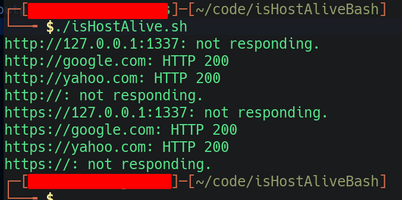

# IsHostAlive

Simple Bash script that takes a list of domains (ex. domains.txt) or ip addresses with port number(ex. 127.0.0.1:1337) and checks to see if it an http or https server. It will redirect its output to the screen and to a file that you designate along with http codes.

-L - sends the request to a redirect if necessary

--silent-- - Silent or quiet mode. Don't show progress meter or error messages.

--insecure - This option allows curl to proceed and operate even for server connections otherwise considered insecure

Sample output:

